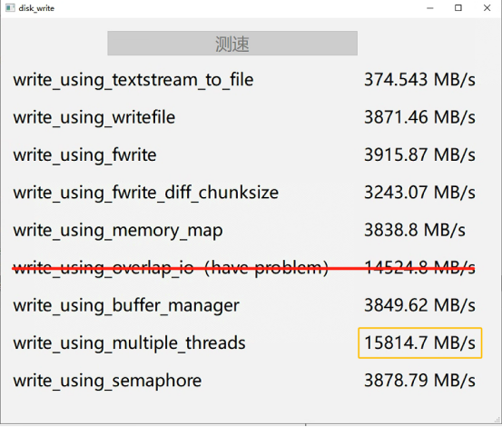
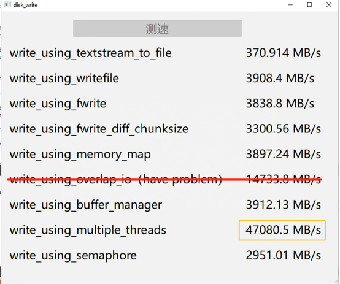
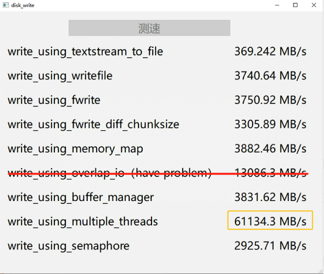
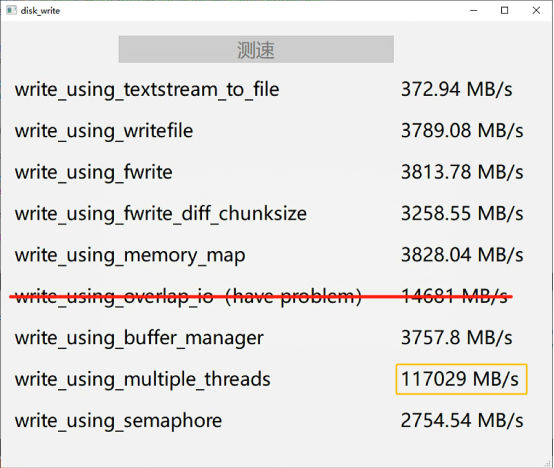
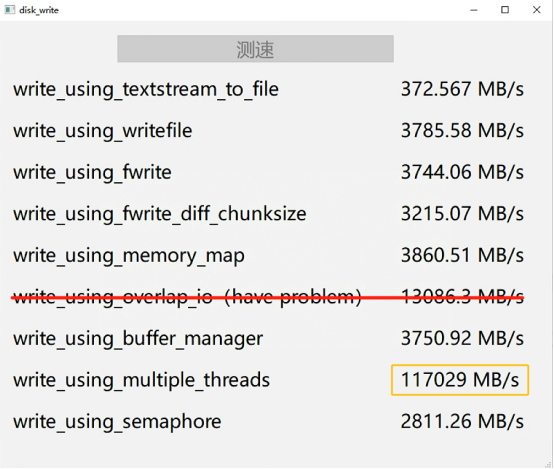

# QT快速写入文件不同方法测试

### 介绍

该仓库用于测试QT中不同的写入文件方法的效率，以及对比不同的写入方法的效率。

### 实现方法

* 使用运算符<< 将 QTextStream 转换为 QFile
* [根据Cprogramming的建议](https://cboard.cprogramming.com/cplusplus-programming/90610-whats-fastest-way-write-file.html)：使用windows系统函数WriteFile写入
* 根据[StackOverflow回答](https://stackoverflow.com/questions/39876152/qt-write-speed-whats-the-fastest-method-to-write-a-file-in-qt)【[Qt - 写入速度 - 在 Qt 中写入文件最快的方法是什么？](https://stackoverflow.com/questions/39876152/qt-write-speed-whats-the-fastest-method-to-write-a-file-in-qt)】，尝试使用fwrite写入
* 尝试使用各种块大小进行写入
* 使用内存映射文件
* 使用Win32 API 函数重叠 IO
* 根据[Codeguru的回答](https://forums.codeguru.com/showthread.php?77477-What-is-the-fastest-way-to-write-data-to-a-file)，使用缓存管理器将完全位于当前文件指针后面的那些缓存页面标记为可重用
* 采用多线程写入，并进行结果合并
* [来自QT Centre的建议](https://www.qtcentre.org/threads/5641-fast-writing-of-large-amounts-of-data-to-files)：增加系统缓冲区，实现一种代理，将数据输入应用程序缓冲区，该缓冲区由另一个线程清空到磁盘

### 测试效果

下图中对应主机的硬盘阵列的最大串行写入速度约40GB/s（使用CrystalDiskMark软件）

四个线程



十二个线程



十六个线程



三十二个线程



六十四个线程



一百二十八个线程


### **结论**

* 不使用多线程写入的方法中，基于流（Stream）的方法速度远低于基于系统调用（fwrite或者writefile）的速度。
* 使用多线程写入的方法中，写入速度和线程数呈现「先正相关后负相关」的关系，并且峰值写入速度大概在磁盘阵列的最大串行写入速度的2~3倍左右。

### 环境需求

> QT5及以上
>
> C++11及以上
>
> Windows

### 可能问题

* Q：代码编译时报错buffer[chunkSize];的大小不是常数。
* A：数组的大小需要在运行时确定，可以使用动态内存分配和指针来创建数组。

```
char* buffer = new char[chunkSize]; // 使用 new 动态分配内存
// 使用 buffer 进行工作
delete[] buffer; // 释放内存
```

* Q：代码刚开始执行抛出stackoverflow的异常。
* A：这个问题同样是由于数组的大小没有在运行时确定导致的，修改方法同上。
