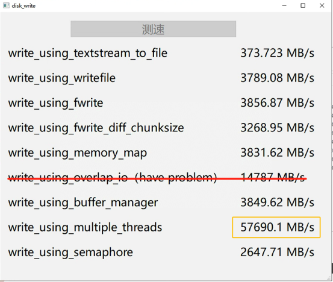

# QT快速写入文件不同方法测试

### 介绍

该仓库用于测试QT中不同的写入文件方法的效率，以及对比不同的写入方法的效率。

### 实现方法

* 使用运算符<< 将 QTextStream 转换为 QFile
* [根据Cprogramming的建议](https://cboard.cprogramming.com/cplusplus-programming/90610-whats-fastest-way-write-file.html)：使用windows系统函数WriteFile写入
* 根据[StackOverflow回答](https://stackoverflow.com/questions/39876152/qt-write-speed-whats-the-fastest-method-to-write-a-file-in-qt)【[Qt - 写入速度 - 在 Qt 中写入文件最快的方法是什么？](https://stackoverflow.com/questions/39876152/qt-write-speed-whats-the-fastest-method-to-write-a-file-in-qt)】，尝试使用fwrite写入
* 尝试使用各种块大小进行写入
* 使用内存映射文件
* 使用Win32 API 函数重叠 IO
* 根据[Codeguru的回答](https://forums.codeguru.com/showthread.php?77477-What-is-the-fastest-way-to-write-data-to-a-file)，使用缓存管理器将完全位于当前文件指针后面的那些缓存页面标记为可重用
* 采用多线程写入，并进行结果合并
* [来自QT Centre的建议](https://www.qtcentre.org/threads/5641-fast-writing-of-large-amounts-of-data-to-files)：增加系统缓冲区，实现一种代理，将数据输入应用程序缓冲区，该缓冲区由另一个线程清空到磁盘

### 测试效果

下图中对应主机的硬盘阵列的最大串行写入速度约40GB/s（使用CrystalDiskMark软件）

四个线程


十二个线程


十六个线程


三十二个线程


六十四个线程


一百二十八个线程



### **结论**

* 不使用多线程写入的方法中，基于流（Stream）的方法速度远低于基于系统调用（fwrite或者writefile）的速度。
* 使用多线程写入的方法中，写入速度和线程数呈现「先正相关后负相关」的关系，并且峰值写入速度大概在磁盘阵列的最大串行写入速度的2~3倍左右。

### 环境需求

> QT5及以上
>
> C++11及以上
>
> Windows

### 可能问题

* Q：代码编译时报错buffer[chunkSize];的大小不是常数。
* A：数组的大小需要在运行时确定，可以使用动态内存分配和指针来创建数组。

```
char* buffer = new char[chunkSize]; // 使用 new 动态分配内存
// 使用 buffer 进行工作
delete[] buffer; // 释放内存
```

* Q：代码刚开始执行抛出stackoverflow的异常。
* A：这个问题同样是由于数组的大小没有在运行时确定导致的，修改方法同上。
* Q：如果我在实际过程中采用多线程写入，速度是否会比测试的效果慢？
* A：大概率是会的，这其中有如下几个可能原因。

  * 测试多线程写入的时候采用的是批量写入相同的数据，而实际过程中，每个线程写入的数据可能不同，需要消耗额外的时间来进行缓冲区数据的拷贝。
  * 实际场景中可能会频繁进行文件的打开和关闭，而测试中只进行了一次打开和关闭，这也会消耗额外的时间。
  * 实际场景中可能会频繁进行线程参数的设置，而测试中只进行了一次线程参数的设置，这也会消耗额外的时间。
  * 实际场景中可能每次写入的数据量不同，因此固定的缓冲区大小可能会导致写入速度的波动。
  * 实际场景中可能写入的不是二进制数据，而测试中统一采用二进制数据进行写入。
  * 实际场景中可能进行了额外的数据传输和转换，例如从unsigned char *转换成QByteArray，而测试中统一采用二进制数据进行写入。【实测中对结果影响最大】

### 实际操作中多线程写入问题

* 问题：
  在测试代码中，理想情况下每次都能够写入大量相同数据，但实际场景中，会出现**每次写入的数据量不同，写入数据频率高**的情况，因此需要对多线程写入进行改进。
* 原因：
  出现问题的原因是多个线程共有文件指针位置竞争条件：每个线程会设置文件指针的位置并进行写入操作。这可能导致线程之间竞争文件指针的问题，从而出现不一致的写入。
* 解决方法：

  * 方法一：解决这个问题，可以通过确保**每个线程都有自己的文件指针位置，不共享**。但实现这个功能需要的ThreadStorage会在每次线程运行的时候创建销毁，同时也没法用线程池维护和管理，因此在我们目前高频率采集数据的场景中，每个线程自有的文件指针会反复被创建销毁，导致速度又变慢了一倍。我们试了能找到的方法，包括异步写入，添加额外的缓冲区，各种调整读取频率，写入频率，线程数量等等，都没法解决它带来的问题。换句话说，现在虽然修复了数据的正确性问题，但为了修复它而引入的额外运算代价很高。
  * 方法二：相比方法一保留了实时写入功能而牺牲了速度，方法二选择把输入数据都攒着，每隔几个G，用异步方法写入一次文件。这种方法没法做到实时写入，但是通过QByteArray的位置来回跳跃写入，可以保证**数据最多只进行一次缓冲区的复制和一次写入磁盘操作**，速度可以达到理论最大值。这种方法的缺点是，虽然程序会丢失最后不足1个G的数据，但是在长期数据采集过程中，数据本身量极大，主要需要保证的是连续采集写入，丢失末尾数据也不会有太大影响。
